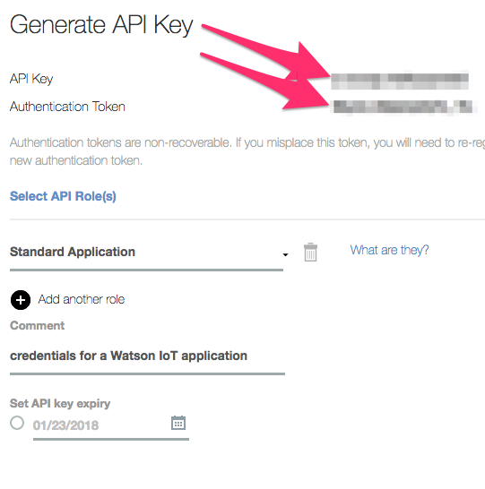

Copyright &copy; 2017  International Business Machines Corporation
All Rights Reserved

----


# streamsx.watsoniot -- toolkits for IBM Streams

The 'streamsx.watsoniot' repository contains operators for IBM Streams that can connect its processing elements (PEs) to the Watson IoT Platform:

* The [com.ibm.streamsx.watsoniot.application](https://ejpring.github.io/streamsx.watsoniot/spldoc/html/tk$com.ibm.streamsx.watsoniot.application/ns$com.ibm.streamsx.watsoniot.application.html) toolkit contains operators that connect a PE to the Watson IoT Platform as a 'application'. These operators should be used in PEs that run in the Streaming Analytics service of the IBM Cloud. They receive event messages from devices via the Watson IoT Platform, decode their data into tuples, and send it downstream to cloud analytics. They may also encode commands from cloud analytics and send them to devices.

* The [com.ibm.streamsx.watsoniot.device](https://ejpring.github.io/streamsx.watsoniot/spldoc/html/tk$com.ibm.streamsx.watsoniot.device/ns$com.ibm.streamsx.watsoniot.device.html) toolkit contains operators that connect a PE to the Watson IoT Platform as a 'device'. These operators should be used in PEs that run outside the IBM cloud. They read sensors for device analytics, encode their data into event messages, and send them to applications via the Watson IoT Platform. They may also decode command messages from applications and send them to device analytics and actuators.

The specifics for configuring each operator are in the [SPLDOC documentation](http://ejpring.github.io/streamsx.watsoniot/spldoc/html/index.html). Note that all of the operators in these toolkits require credentials from Watson IoT Platform, as described below. 

The repository includes several samples that illustrate how the operators can be configured in SPL flow graphs to connect analytics to the Watson IoT Platform.


# com.ibm.streamsx.watsoniot.application toolkit

PEs that run in the Streaming Analytics service of the IBM Cloud connect to the Watson IoT Platform as 'applications'. These PEs can connect with either the WatsonIoTApplicationConnector, or a pair of WatsonIoTApplicationSource and WatsonIoTApplicationSink operators. In any case, these operators require application credentials granted by Watson IoT Platform, as described below.

### data flow for Watson IoT applications

The WatsonIoTApplicationConnector operator consumes 'commands' as input tuples and produces 'events' as output tuples. By default, data is encoded as a JSON string in both events and commands. Data flows between the WatsonIoTApplicationConnector and cloud analytics like this:


Alternatively, PEs may connect to the Watson IoT Platform as applications with a pair of WatsonIoTApplicationSource and WatsonIoTApplicationSink operators, which separately produce 'events' and consume 'commands', respectively. Data flows between these operators and cloud analytics like this:


### event subscriptions for Watson IoT applications

By default, Watson IoT applications receive all events from all devices in their IBM Cloud organization. The 'subscription' parameters of the [WatsonIoTApplicationConnector](https://ejpring.github.io/streamsx.watsoniot/spldoc/html/tk$com.ibm.streamsx.watsoniot.application/op$com.ibm.streamsx.watsoniot.application$WatsonIoTApplicationConnector.html) and [WatsonIoTApplicationSource](https://ejpring.github.io/streamsx.watsoniot/spldoc/html/tk$com.ibm.streamsx.watsoniot.application/op$com.ibm.streamsx.watsoniot.application$WatsonIoTApplicationSource.html) operators can be specified to restrict the events they receive by event name, data format, device type, or device identifier.

### credentials for Watson IoT applications

The operators in the 'com.ibm.streamsx.watsoniot.application' toolkit require application credentials granted by the Watson IoT platform to connect. To create application credentials, open a web browser at the [IBM Cloud Dashboard](https://console.bluemix.net/dashboard/apps), click on your 'Internet of Things Platform', and launch your 'Watson IoT Platform' dashboard. Then, click "Apps" in the left-side toolbar, and then click "+Generate API Key" to reach this page:



Before clicking 'Generate', copy the 'API Key' and 'Authentication Token' fields into an '*applicationid*.credentials.properties' file, like this:

```
[application]
org = ... paste IBM Cloud 'organization ID' here ...
id = ... assign an identifier for the application here ...
auth-method = apikey
auth-key = ... paste Watsopn IOT 'API Key' here ...
auth-token = ... paste Watson IoT 'Authentication Token here ...
enable-shared-subscription = false
```

See [Using a configuration file](https://github.com/IBM-Bluemix-Docs/IoT/blob/master/applications/libraries/java.md#constructor) for the details of application credentials files.

The contents of the credentials file must be passed to the WatsonIoTApplicationConnector operator as a single string, with newline characters replaced by commas, as the value of the 'applicationCredentials' parameter. Or, when a pair of WatsonIoTApplicationSource and WatsonIoTApplicationSink operators are used, the same string must be passed to both operators, and they must be fused into the same PE.

The scripts that submit the sample Watson IoT applications to the IBM Cloud require credentials granted by the Streaming Analytics service. To get service credentials, open a web browser at the [IBM Cloud Dashboard](https://console.bluemix.net/dashboard/apps), click on your Streaming Analytics service, click 'Service credentials', then click 'View credentials' to reach this page:


Click the "copy to clipboard" icon to get the service credentials as a JSON string and paste them into a 'vcap.json' file, like this:

```
{
    "streaming-analytics": [
    {
        "name":
            "... paste service name here, in quotes ...",
        "credentials":
             ... paste service credentials here, including curly braces ...
        }
    ]
}
```

### sample SPL source code for Watson IoT applications

This repository includes sample SPL source code that illustrates how the 'application' operators in a PE running in the Streaming Analytics service of the IBM Cloud can be configured to recieve events from the Watson IoT Platform and send commands to it. Each sample is included in the repository as a separate Eclipse project for Streams Studio:

* The [SampleWatsonIoTApplicationConnector](https://ejpring.github.io/streamsx.watsoniot/spldoc/html/tk$SampleWatsonIoTApplicationConnector/spl$com.ibm.streamsx.watsoniot.sample.application$SampleWatsonIoTApplicationConnector.html) project illustrates the [WatsonIoTApplicationConnector](https://ejpring.github.io/streamsx.watsoniot/spldoc/html/tk$com.ibm.streamsx.watsoniot.application/op$com.ibm.streamsx.watsoniot.application$WatsonIoTApplicationConnector.html) operator

* The [SampleWatsonIoTApplicationSourceAndSink](https://ejpring.github.io/streamsx.watsoniot/spldoc/html/tk$SampleWatsonIoTApplicationSourceAndSink/spl$com.ibm.streamsx.watsoniot.sample.application$SampleWatsonIoTApplicationSourceAndSink.html) project illustates the [WatsonIoTApplicationSource](https://ejpring.github.io/streamsx.watsoniot/spldoc/html/tk$com.ibm.streamsx.watsoniot.application/op$com.ibm.streamsx.watsoniot.application$WatsonIoTApplicationConnector.html) and [WatsonIoTApplicationSink](https://ejpring.github.io/streamsx.watsoniot/spldoc/html/tk$com.ibm.streamsx.watsoniot.application/op$com.ibm.streamsx.watsoniot.application$WatsonIoTApplicationConnector.html) operators

These projects encode data for both events and commands in the default format of 'json', and depend upon the 'com.ibm.streamsx.json' toolkit. That toolkit is included in the IBM Streams product at '$STREAMS_INSTALL/toolkits/com.ibm.streams.json'.

To try these samples, do this:

* Get your Streaming Analytics service credentials as described above and store them in the project directories in 'vcap.json' files, using the 'vcap-template.json' files in those directories as guides. 

* Generate Watson IoT application credentials as described above and store them in the project directories as '*applicationid*.credentials.properties' files, using the '*applicationid*.credentials-template.properties' files in those directories as guides.

* Install Python version 3, if not already installed, and then install the Python 'streamsx' package by executing these commands at a Linux command prompt:

```
sudo yum install https://centos6.iuscommunity.org/ius-release.rpm
sudo yum install python36u python36u-pip python36u-devel 
sudo pip3.6 install streamsx==1.7.4
```

* Open a Linux 'Terminal' window and go to one of the sample directories:
```bash
cd $HOME/git/streamsx.watsoniot/samples/SampleWatsonIoTApplicationConnector
... or ...
cd $HOME/git/streamsx.watsoniot/samples/SampleWatsonIoTApplicationSourceAndSink
```

* Build the sample SPL source code into a Streams Application Bundle (SAB) by executing this BASH script at a command prompt:
```
build.sh
```

* Run the SAB bundle locally for a minute by executing this BASH script at a command prompt:
```
run.sh
```

* Or, submit the SAB bundle to run as a job in the Streaming Analytics service of the IBM Cloud by executing this Python script at a command prompt:
```
python3.6 submitJob.py
```

* Run one of the 'device' samples described below concurrently with the 'application' sample to illustrate receiving events as well as sending commands.

* The application is configured to run for an hour and then cancel itself. Or, cancel the job before it times out by executing this Python3 script at a command prompt:
```
python3.6 cancelJob.py
```

The 'run.sh' and 'submitJob.py' scripts configure the sample SPL code to run for a minute and an hour, respectively, and then terminate themselves. You can change their timeouts by editing the script files and changing the 'timeoutInterval' parameter, specifying a new value in seconds. 


# com.ibm.streamsx.watsoniot.device toolkit

PEs that run outside the IBM Cloud connect to Watson IoT Platform as 'devices'. These PEs can connect with either the WatsonIoTDeviceConnector, or a pair of WatsonIoTDeviceSource and WatsonIoTDeviceSink operators. In any case, these operators require device credentials granted by Watson IoT Platform, as described below.

### data flow for Watson IoT devices

The WatsonIoTDeviceConnector operator consumes 'events' as input tuples and produces 'commands' as output tuples. By default, data is encoded as a JSON string in both events and commands. Data flows between the WatsonIoTPlatformDeviceConnector and device analytics like this:


Alternatively, PEs may connect to the Watson IoT Platform as devices with a pair of WatsonIoTDeviceSource and WatsonIoTDeviceSink operators, which separately consume 'events' and produce 'commands', respectively. Data flows between these operators and device analytics like this:


### credentials for Watson IoT devices

The operators in the 'com.ibm.streamsx.watsoniot.device' toolkit require device credentials granted by the Watson IoT platform to connect. To create device credentials, open a web browser at the [IBM Cloud Dashboard](https://console.bluemix.net/dashboard/apps), click on your 'Internet of Things Platform', and launch your 'Watson IoT Platform' dashboard. Then click "Devices" in the left-side toolbar, and click "+Add Device". Fill in the forms, clicking "Next" on each one. Then click "Done" on the "Summary" to reach this page:


*After clicking 'Done'*, copy the 'Organization ID', 'Device Type', 'Device ID', and 'Authentication Token' fields into a '*deviceid*.credentials.properties' file, like this:

```
[device]
org = ... paste IBM Cloud 'organization ID' here ...
type = ... paste Watson IoT device type here ...
id = ... paste Watson IoT device ID here ...
auth-token = ... paste Watson IoT 'Authentication Token' here ...
auth-method = token
```

See [Using a configuration file](https://github.com/IBM-Bluemix-Docs/IoT/blob/master/devices/libraries/java.md#constructor) for the details of device credentials files.

The contents of the credentials file must be passed to the WatsonIoTDeviceConnector operator as a single string, with newline characters replaced by commas, as the value of the 'deviceCredentials' parameter. Or, when a pair of WatsonIoTDeviceSource and WatsonIoTDeviceSink operators are used, the same string must be passed to both operators, and they must be fused into the same PE.

### sample SPL source code for Watson IoT devices

This repository includes sample SPL source code that illustrates how the 'device' operators in PEs running outside the IBM Cloud can be configured to send events to the Watson IoT Platform and receive commands from it. Each sample is included in the repository as a separate Eclipse project for Streams Studio:

* The [SampleWatsonIoTDeviceConnector](https://ejpring.github.io/streamsx.watsoniot/spldoc/html/tk$SampleWatsonIoTDeviceConnector/spl$com.ibm.streamsx.watsoniot.sample.device$SampleWatsonIoTDeviceConnector.html) project illustrates the [WatsonIoTDeviceConnector](https://ejpring.github.io/streamsx.watsoniot/spldoc/html/tk$com.ibm.streamsx.watsoniot.device/op$com.ibm.streamsx.watsoniot.device$WatsonIoTDeviceConnector.html) operator

* The [SampleWatsonIoTDeviceSourceAndSink](https://ejpring.github.io/streamsx.watsoniot/spldoc/html/tk$SampleWatsonIoTDeviceSourceAndSink/spl$com.ibm.streamsx.watsoniot.sample.device$SampleWatsonIoTDeviceSourceAndSink.html) project illustates the [WatsonIoTDeviceSource](https://ejpring.github.io/streamsx.watsoniot/spldoc/html/tk$com.ibm.streamsx.watsoniot.device/op$com.ibm.streamsx.watsoniot.device$WatsonIoTDeviceSource.html) and [WatsonIoTDeviceSink](https://ejpring.github.io/streamsx.watsoniot/spldoc/html/tk$com.ibm.streamsx.watsoniot.device/op$com.ibm.streamsx.watsoniot.device$WatsonIoTDeviceSink.html) operators

These projects encode data for both events and commands in the default format of 'json', and depend upon the 'com.ibm.streamsx.json' toolkit. That toolkit is included in the IBM Streams product at '$STREAMS_INSTALL/toolkits/com.ibm.streams.json'.

To try these samples, generate device credentials as described above and store them in the project directories as '*deviceid*.credentials.properties' files, using the '*deviceid*.credentials-template.properties' files in those directories as guides.

* Open a Linux 'Terminal' window and go to one of the sample directories:
```bash
cd $HOME/git/streamsx.watsoniot/samples/SampleWatsonIoTDeviceConnector
... or ...
cd $HOME/git/streamsx.watsoniot/samples/SampleWatsonIoTDeviceSourceAndSink
```

* Build the sample SPL source code into a Streams Device Bundle (SAB) by executing this BASH script at a command prompt:
```
build.sh
```

* Run the SAB bundle in standalone mode by executing this BASH script at a command prompt:
```
run.sh
```

* Run one of the 'application' samples described above concurrently with the 'device' sample to illustrate receiving commands as well as sending events.

The 'run.sh' script configures the sample SPL code to run for a limited period of time and then terminate itself. You can change its timeout by editing the script file and changing the 'timeoutInterval' parameter, specifying a new value in seconds. Or, to cancel the 'run.sh' script immediately, type 'Ctrl-C' twice. 

----
